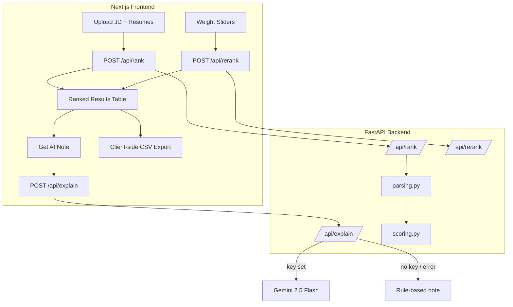

# Resume Ranking & Job-Fit Scoring Tool

An end-to-end tool that scores and ranks a batch of resumes against a target job
description. It combines TF-IDF + cosine similarity text relevance with rule-based
entity extraction (skills, years of experience, education level) into a single,
fully explainable, weighted fit score — so a recruiter can go from "job description
+ pile of resumes" to a ranked shortlist with per-candidate rationale in seconds.

Built entirely on free-tier infrastructure: no required paid APIs. An optional
Gemini 2.5 Flash integration adds AI-generated recruiter notes if you provide a free
`GEMINI_API_KEY`; without one, the app falls back to a rule-based note and works
identically otherwise.

## Architecture



See `docs/ARCHITECTURE.md` for the full data flow, API contract, and a worked
scoring example.

## Tech Stack

- **Backend**: FastAPI, scikit-learn (TF-IDF + cosine similarity), pandas/numpy,
  pypdf, python-docx, pydantic, pytest
- **Frontend**: Next.js 16 (App Router), TypeScript, Tailwind CSS, shadcn/ui
  (backed by `@base-ui/react`)
- **AI (optional)**: `google-generativeai` (Gemini 2.5 Flash) for recruiter notes,
  with a rule-based fallback when no API key is configured
- **Deployment**: Vercel (hybrid Next.js + Python serverless function)

## How Scoring Works (short version)

```
overall_score = 100 * (
    0.4 * text_similarity
  + 0.3 * skill_overlap
  + 0.2 * experience_fit
  + 0.1 * education_fit
)
```

All four weights are adjustable live in the UI via sliders, which call
`/api/rerank` to recompute scores from already-extracted data without re-uploading
files. Full formula and a worked numeric example: `docs/ARCHITECTURE.md`.

## Local Setup

### Backend

```powershell
cd resume-ranking-jobfit
python -m venv venv
.\venv\Scripts\Activate.ps1
pip install -r requirements.txt
uvicorn api.index:app --reload --port 8000
```

Backend runs at `http://localhost:8000`. Health check: `GET /api/health`.

### Frontend

```powershell
cd resume-ranking-jobfit\app
npm install
npm run dev
```

Frontend runs at `http://localhost:3000` and talks to the backend via
`NEXT_PUBLIC_API_URL` (defaults to `http://localhost:8000`; see
`app/.env.local.example`).

### Running Tests

```powershell
cd resume-ranking-jobfit
.\venv\Scripts\Activate.ps1
pytest tests/ -v
```

43 tests covering skill matching, experience-duration regex parsing across multiple
date formats, education-level detection, and the weighted scoring formula — all
passing.

### Optional: AI-Generated Recruiter Notes

Copy `.env.example` to `.env` (or set the environment variable directly) and add a
free Gemini API key from [Google AI Studio](https://aistudio.google.com/):

```
GEMINI_API_KEY=your-key-here
```

Without a key, `/api/explain` automatically returns a rule-based templated note
built from the same extracted data — the app never breaks or crashes due to a
missing key.

## Deploying to Vercel

See `docs/DEPLOYMENT.md` for full steps, environment variables, and the reasoning
behind the 15-file upload cap and cold-start considerations. Short version:

1. Push to a Git provider and import into Vercel.
2. Vercel auto-detects Next.js (`app/`) and the Python function (`api/index.py`) per
   `vercel.json`.
3. Set `GEMINI_API_KEY` (optional) and `NEXT_PUBLIC_API_URL` in project settings.
4. Deploy.

## Project Structure

```
resume-ranking-jobfit/
├── README.md
├── docs/                    PRD, architecture, data, deployment docs
├── memory/                  Decisions log, glossary, build journal
├── notebooks/               TF-IDF experiments + scoring validation (executed)
├── api/                     FastAPI app, parsing.py, scoring.py, skills taxonomy
├── data/                    Sample resumes (.txt) and job descriptions (.txt)
├── app/                     Next.js frontend (App Router, TS, Tailwind, shadcn/ui)
├── tests/                   pytest suite for parsing + scoring
├── requirements.txt
├── vercel.json
└── .env.example
```

## Deviations from Spec

- **Python version**: `requirements.txt` targets Python 3.12 (not the newest
  Python 3.14 found on the build machine), because scikit-learn does not yet ship
  prebuilt wheels for 3.14 on Windows and a source build failed against the local
  MSVC toolchain. No code changes were needed — this is purely a "use a 3.12 venv"
  note for anyone setting this up locally. See `memory/JOURNAL.md` for details.
- **shadcn/ui**: the CLI init and component installation worked without issues on
  this Windows/PowerShell environment, so all UI primitives (`button`, `card`,
  `table`, `slider`, `badge`, `tabs`, `separator`, `textarea`, `input`, `label`,
  `progress`) are genuine shadcn/ui components — no hand-rolled fallback was
  required.

## TODOs for the User

- Run `pip install -r requirements.txt` (Python 3.12 recommended) and
  `npm install` (in `app/`) before first run — see Local Setup above.
- Optionally set `GEMINI_API_KEY` (see `.env.example`) to enable AI-generated
  recruiter notes; otherwise the rule-based fallback is used automatically.
- Add real product screenshots here once you've run the app locally
  (`[Screenshot placeholder: upload panel]`, `[Screenshot placeholder: ranked table
  with breakdown panel expanded]`).
- Before deploying to Vercel, initialize git (`git init`, commit, push) — this
  project was intentionally left without a git repo per the build instructions.
