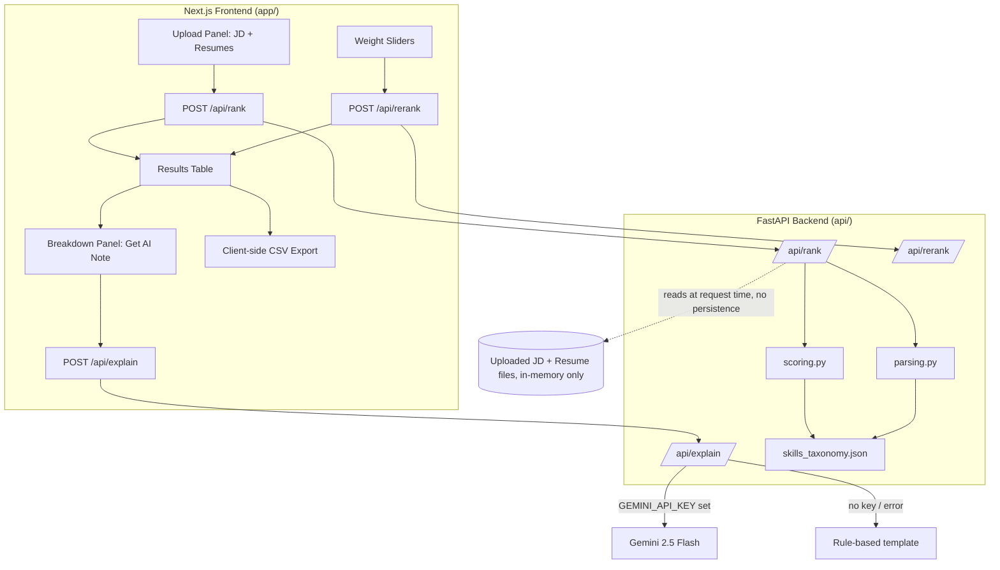

# Architecture

## System Overview



## Data Flow

1. **Upload**: user pastes/uploads a JD and drags in up to 15 resume files
   (.txt/.pdf/.docx).
2. **Extraction** (`api/parsing.py`): each file is converted to plain text
   (`extract_text_from_bytes`), then normalized (`normalize_text`).
3. **Similarity** (`api/scoring.py`): a `TfidfVectorizer` is fit **jointly** on
   `[jd_text, *resume_texts]` for this single request, and cosine similarity of each
   resume vector against the JD vector is computed. This produces a similarity score
   in `[0, 1]` per resume.
4. **Entity extraction** (per resume, `api/parsing.py`):
   - **Skills**: case-insensitive substring/word-boundary match against
     `skills_taxonomy.json` (~277 skills across 14 categories).
   - **Experience**: regex over common date-range formats
     (`Jan 2020 - Present`, `2019-2022`, `03/2020 to 11/2021`), summing durations,
     with `Present`/`Current` resolved to today's date.
   - **Education**: keyword rules mapped to a level 0 (none) through 4 (PhD), taking
     the highest level found in the text.
5. **Scoring** (`api/scoring.py`): each resume's four components (similarity, skill
   overlap ratio, experience fit, education fit — all normalized to `[0, 1]`) are
   combined into a single weighted `overall_score` in `[0, 100]`.
6. **Response**: `/api/rank` returns all candidates sorted descending by
   `overall_score`, each with full component breakdown, matched skills, and missing
   skills.
7. **Live re-ranking**: the frontend keeps each candidate's raw component scores in
   memory. When the user moves a weight slider, `/api/rerank` recomputes
   `overall_score` from the *already-extracted* component scores (no re-parsing, no
   re-upload) and the table re-sorts.
8. **Explain** (optional): clicking "Get AI Note" on an expanded candidate row calls
   `/api/explain` with that candidate's extracted data + the JD text. If
   `GEMINI_API_KEY` is set, a grounded prompt is sent to Gemini 2.5 Flash instructing
   it not to invent facts beyond what's given; on any failure (no key, network error,
   quota, bad response) the endpoint falls back to a deterministic rule-based
   templated note built from the same data — the app never crashes or blocks on this.

## Why TF-IDF over embeddings?

We deliberately chose classic TF-IDF + cosine similarity over a semantic embedding
model (e.g., sentence-transformers, OpenAI/Gemini embeddings) for the core
text-similarity component:

| Consideration | TF-IDF | Embeddings |
|---|---|---|
| Cost | Free, pure CPU, scikit-learn | Free tiers exist, but rate-limited or need a model download |
| Latency | Sub-100ms even for 15 resumes, fits per-request on a serverless function | Model load / API round-trip adds seconds, complicates cold starts |
| Explainability | Directly inspectable: which shared terms drove the score | Opaque vector space, harder to explain to a recruiter |
| Infra | No model weights to ship/download, no GPU, no vector DB | Needs a model artifact or external API call per resume |
| Serverless fit (Vercel) | Fits comfortably within function size/time/memory limits | Larger deployment bundle or added external dependency risk |

**Tradeoff acknowledged**: TF-IDF is a bag-of-words method and misses synonymy/semantic
similarity (e.g., "ML" vs. "machine learning" as different tokens, though we mitigate
overlapping terminology partially via the skills taxonomy layer, which uses exact
phrase matching for known synonyms/aliases). For this tool's target use case — a
fast, cheap, explainable *first-pass* filter, not a final hiring decision — this
tradeoff favors TF-IDF. A production system with budget for embeddings could swap
`compute_tfidf_similarity` for an embedding-based equivalent without changing the
rest of the scoring pipeline, since it's isolated to a single pure function.

## API Contract

### `POST /api/rank`

Multipart form data:

| Field | Type | Notes |
|---|---|---|
| `jd_text` | string (optional) | Pasted JD text; required if `jd_file` not given |
| `jd_file` | file (optional) | .txt/.pdf/.docx; takes precedence over `jd_text` |
| `resumes` | file[] | 1-15 files, .txt/.pdf/.docx |
| `weight_similarity` | float | default 0.4 |
| `weight_skills` | float | default 0.3 |
| `weight_experience` | float | default 0.2 |
| `weight_education` | float | default 0.1 |
| `required_years` | float | default 3.0, used for experience fit scaling |
| `required_education` | int | default 2 (Bachelors), used for education fit scaling |

Example response:

```json
{
  "candidates": [
    {
      "filename": "priya_sharma_data_analyst_senior.txt",
      "overall_score": 66.09,
      "similarity": 0.4523,
      "skill_overlap": 0.6,
      "experience_years": 8.02,
      "experience_fit": 1.0,
      "education_level": 3,
      "education_fit": 1.0,
      "matched_skills": ["Python", "SQL", "Tableau", "Excel", "..."],
      "missing_skills": ["BigQuery", "Redshift", "..."]
    }
  ],
  "weights": { "similarity": 0.4, "skills": 0.3, "experience": 0.2, "education": 0.1 }
}
```

### `POST /api/rerank`

JSON body with previously-extracted component scores per candidate + new weights;
returns recomputed `overall_score`s, sorted descending. No file re-parsing occurs.

### `POST /api/explain`

JSON body with one candidate's extracted data + the JD text; returns a 3-bullet
recruiter note (`source: "gemini-2.5-flash"` or `"rule_based"` / `"rule_based_fallback"`).

## Scoring Formula — Worked Example

```
overall_score = 100 * (
    w_similarity * similarity
  + w_skills     * skill_overlap
  + w_experience * experience_fit
  + w_education  * education_fit
) / (w_similarity + w_skills + w_experience + w_education)
```

Default weights: `similarity=0.4, skills=0.3, experience=0.2, education=0.1` (sums to 1.0).

**Worked example** — a candidate with:
- `similarity = 0.8` (strong textual overlap with the JD)
- `skill_overlap = 0.6` (matched 6 of 10 JD-required skills)
- `experience_fit = 0.5` (has 1.5 of the 3 required years, linear scaling)
- `education_fit = 1.0` (meets or exceeds required education level)

```
overall_score = 100 * (0.4*0.8 + 0.3*0.6 + 0.2*0.5 + 0.1*1.0) / 1.0
              = 100 * (0.32 + 0.18 + 0.10 + 0.10)
              = 100 * 0.70
              = 70.0
```

This matches `tests/test_scoring.py::test_weighted_score_default_weights_worked_example`.

Sub-component formulas:
- `experience_fit = min(1.0, experience_years / required_years)` — linear ramp to 1.0.
- `education_fit = 1.0` if `education_level >= required_level`, else
  `max(0, 1 - 0.34 * (required_level - education_level))` — each level below the
  requirement costs ~34% of fit.
- `skill_overlap = |matched skills| / |JD-required skills|` (both sets extracted via
  the same taxonomy matcher).

Weights need not sum to exactly 1.0 — the formula normalizes by their sum, so e.g.
weights of `[2, 0, 0, 0]` behave identically to `[1, 0, 0, 0]` (see
`test_weighted_score_normalizes_when_weights_dont_sum_to_1`).
